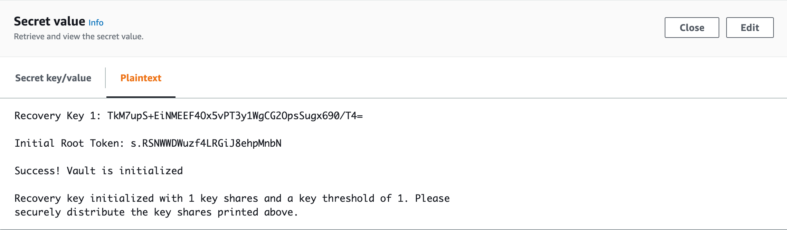
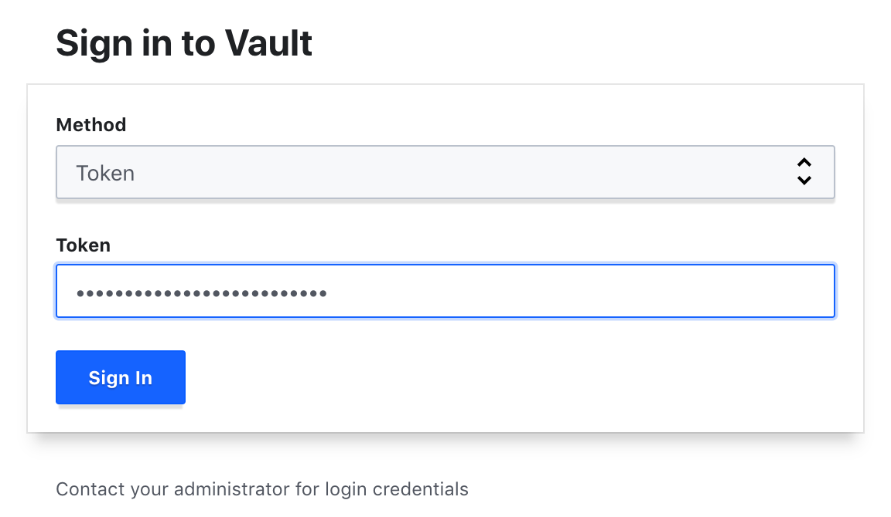
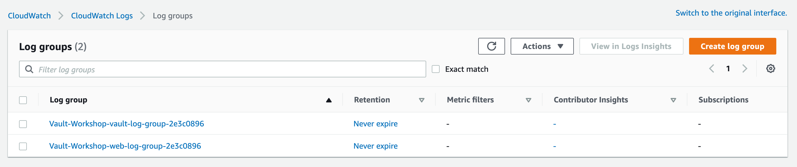

# Welcome to the AWS, HashiCorp, Gremlin and Gitlab Workshop!

### Workshop Index:

* Let’s get you started in your AWS Account
* Welcome to your GitLab Server
* Welcome to HashiCorp Vault Workshop

# Let’s get you started in your AWS Account:

### In this workshop you will be setting a few critical things:

* In your AWS Account provided by the Vault Workshop Team (Found on your dashboard), you will be standing up all these resources
* We will be starting with creating your AWS Cloud 9 Instance, this will be your Cloud IDE for this workshop!
* Setting up your HashiCorp Cloud Trail as we will be using Terraform to deploy your resources.
* Connected your AWS Account to HashiCorp Cloud, so we can keep state of our deployments
* Now the fun starts, grab the Terraform configuration files listed below.
* Let’s start with deploying Vault

# Welcome to your GitLab Server

### Getting Started

* Ensure the AWS security keys are valid.
* Update the CI/CD variables in the Gitlab project.

### Prerequisites

* Working AWS security keys are needed in the Gitlab CI/CD configuration.
* Terraform > 0.12. If you are using an older version of Terraform then you WILL receive an error. Download the [latest terraform here](https://releases.hashicorp.com/terraform/) and unzip it to your `$PATH`.
* Terraform Cloud account. Please sign up for a [Terraform Cloud account](https://app.terraform.io/signup/account).
* Terraform Cloud workspace. Please visit [Creating and Managing Terraform Workspaces](https://www.terraform.io/docs/cloud/getting-started/workspaces.html)
* Update the AWS security keys as variables in Terraform Cloud workspace.
* Export the AWS security keys as environment variables in AWS Cloud 9 instance.

### Setting up Gitlab Enterprise, Terraform Cloud and VCS Integration

1. Create project and repository in Gitlab. Upload code from linked repo. Follow instructions for uploading an existing repo. Replace `<GITLAB SERVER HTTP ENDPOINT>` with the full HTTP URL of the gitlab server instance you deployed (i.e: http://ec2-3-86-27-52.compute-1.amazonaws.com/root/test2.git)
* cd existing_repo
* git remote rename origin old-origin
* git remote add origin <GITLAB SERVER HTTP ENDPOINT>
* git push -u origin --all
* git push -u origin —tags

2. Create an account at https://app.terraform.io

3. Create an organization

4. Setup [VCS integration for GitLab Enterprise](https://www.terraform.io/docs/cloud/vcs/gitlab-eece.html)

5. Create a new workspace, tie to to repository created in step 1
* Set working directory to `vault-workshop`
* Set environment variables based on information in Gameday dashboard

6. Trigger a `terraform init`, `terraform plan` and `terraform apply`

### Deploying the Vault Workshop stacks

No installation is required. However, this can be run locally by following the Terraform commands:

``terraform init``

Initializes terraform; connects to S3 backend; download required modules

``terraform plan``

Verifies all the plans work.

``terraform apply``

Creates the infrastructure & GitLab instances

``terraform destroy ``

Destroys the infrastructure & instances that Terraform created.


# Welcome to HashiCorp Vault Workshop

### Getting Started

* Verify Vault, MySQL, and Web Server outputs after `terraform  apply` run is  finished:
```sh
Outputs:

MySQL_DB_Name = petclinic
MySQL_Host_IP = 172.17.1.101
MySql_Url = jdbc:mysql://172.17.1.101:3306/petclinic
Vault_Server_HTTP_Address = http://52.90.123.195:8200
Vault_Server_Public_IP = 52.90.123.195
Web_Server_HTTP_Address = http://3.228.15.83:8080
Web_Server_Public_IP = 3.228.15.83
```

*  Verify Vault secret with root token created in AWS Secrets Manager



* Log into Vault with root token



* Navigate Web Server HTTP address


* Navigate AWS CloudWatch logs




